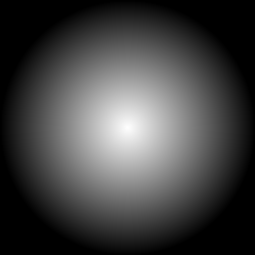
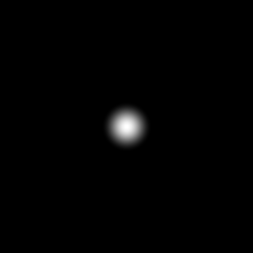

# FFTWindow
This plugin was made to easily apply various window functions to images and stacks (including hyperstacks).
It can be used to apply a small selection of windows (currently Bartlett, Hanning, Blackman), or a custom filter image, to a multidimensional image.

When using using the plugin via Java, it is also possible to provide a lambda function which is used to create a filter image.

## Usage
Open any image (and a custom filter if desired) and open the plugin (Plugins>FFTWindow>Run) and select a window.
If Modified-Tukey is chosen, the alpha-value and n-value can be changed to adjust the width of the filter, with alpha 1 being a top-hat function and 0 being equal to the Hanning filter. The n values dictates the edges of the value, effectively noting the fraction where the entire image will be black. 

## Examples of windows

|   |  |  |
|:---:|:---:|:---:|
| Bartlett | Hanning | Blackman |

|   |  |
|:---:|:---:|
| Tukey (a=0.2, n=0.8) | Tukey (a=0, n=0.2) | 

